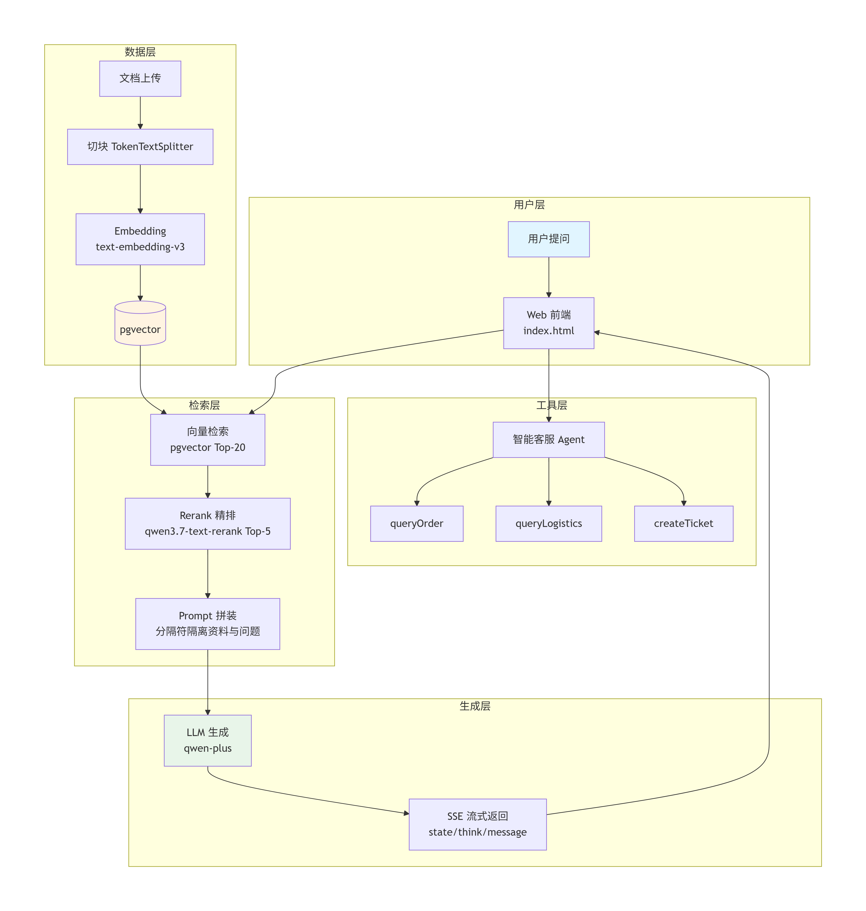

# Spring Ai RAG 知识库问答系统

基于 Spring Boot 3.4 + Spring AI 1.0 + pgvector 的企业级 RAG 问答系统，支持向量检索  + Rerank 精排 + SSE 流式输出 + Tool Calling。


## 一、核心能力

- **RAG 全链路** ：文档上传 -> 切块 -> Embedding -> 检索 -> 生成
- **两阶段检索** ：向量粗召回 Top-20 + Rerank 精排 Top-5
- **流式输出** ：SSE 三字段协议（state / think /message）、Flux，打字机效果
- **工具调用** ：智能客服场景，内置 6 个业务工具（订单查询、订单列表、物流查询、用户详情、退款、转人工），支持多轮会话与报表生成
- **量化评估** ： RAGAS 四指标（faithfulness / answer_relevancy / context_precision /context_recall）

## 二、架构图




## 三、技术栈

| 层     | 技术                                                        |
| ------ | ----------------------------------------------------------- |
| 框架   | Spring Boot 3.4.1                                           |
| AI     | Spring AI 1.0.0 + 通义千问（qwen-plus / text-embedding-v3） |
| 向量库 | PostgreSQL + pgvector                                       |
| Rerank | 百炼 qwen3.7-text-rerank                                    |
| 流式   | SSE（SseEmitter + Flux 双实现）                             |
| 前端   | 原生 HTML + EventSource                                     |


## 四、快速开始

### 1、环境准备

JDK 21

原生安装 pgvector

通义千问 API Key

### 2、安装pgvector

请移步这里 [postgreSQL安装向量数据库.md](docs/postgreSQL%E5%AE%89%E8%A3%85%E5%90%91%E9%87%8F%E6%95%B0%E6%8D%AE%E5%BA%93.md)

### 3、配置

```yaml
spring:
  ai:
    dashscope:
      api-key: ${DASHSCOPE_API_KEY}
```

### 4、启动

```bash
mvn spring-boot:run
```

访问 `http://localhost:9092/index.html`

## 五、核心接口

| 接口                         | 说明                            |
| ---------------------------- | ------------------------------- |
| POST /api/ingestion/upload   | 文档上传（切块+Embedding+入库） |
| GET /api/chat/ask            | RAG 同步问答（含 Rerank）       |
| GET /api/chat/ordinaryAsk    | 普通同步问答（纯向量检索）      |
| GET /api/sse/ask/stream      | SSE 流式问答（SseEmitter）      |
| GET /api/sse/ask/stream/flux | SSE 流式问答（Flux）            |
| GET /api/cs/chat             | 智能客服（工具调用）            |
| GET /api/chat                | 多轮对话（sessionId 隔离）      |


## 六、评估数据

20 条测试集（含 3 条拒答题），评估模型 qwen-plus。

| 指标              | 得分 | 剔除拒答题后 |
| ----------------- | ---- | ------------ |
| faithfulness      | 0.82 | **0.97**     |
| answer_relevancy  | 0.75 | 0.83         |
| context_precision | 0.72 | —            |
| context_recall    | 0.79 | —            |

**结论**：
- 生成质量优秀：faithfulness 剔除拒答后 ~0.97，几乎零幻觉
- 检索精准度有提升空间：context_precision 0.72
- 4 条因评估模型输出格式问题失败（qwen-plus 兼容性，非系统问题）

## 七、项目目录

```yaml
spring-ai-demo/
├── src/main/java/com/example/
│ ├── config/ # AgentConfig, VectorStoreConfig, SseState
│ ├── controller/
│ │ ├── RagController.java # 同步问答
│ │ ├── IngestionController.java # 文档上传
│ │ ├── ChatController.java # 同步问答和重排序问答
│ │ ├── WebSseEmitterFluxController.java # SSE + Flux 流式
│ │ ├── CustomerServiceController.java # 智能客服
| | └── ChatTestController.java # 多用户多轮会话的智能客服
│ ├── service/
│ │ ├── DocumentIngestionService.java # 批量读取本地文件 + 切块 + 入库
│ │ ├── IngestionService.java # 切块 + 入库
│ │ ├── ChatService.java # Rerank + 检索 + 入库
│ │ ├── RagChatService.java # 检索 + 生成
│ │ ├── RerankService.java # Rerank 封装
│ │ ├── CustomerServiceAgent.java # 工具调用 Agent
│ │ └── WebSseEmitterService.java # SSE + Flux 推送
│ ├── tools/
│ │ └── CustomerServiceTools.java # 3 个 @Tool 方法
│ ├── tool/
│ │ ├── ActionTools.java # 2 个 @Tool 方法 退款和转人工
│ │ ├── LogisticsTools.java # 1 个 @Tool 方法 物流查询
│ │ ├── OrderTools.java # 2 个 @Tool 方法 根据订单ID查询详情，根据用户ID查询订单列表
│ │ └── UserTools.java # 1 个 @Tool 方法 查询用户详情信息
│ └── dto/
│ ├── SseEvent.java # state/think/message
│ ├── EvalResult.java
│ └── RetrieveResult.java 
│ └── agent.data/
│ └── MockDataStore.java # 模拟真实数据库，存放到内存
├── src/main/resources/
│ ├── application.yml
│ └── static/index.html # 前端页面
└── docs/
├── ragas-report.md # 评分
└── tool-calling.md
```


## 八、踩坑记录

### 1. Prompt 拼接导致 30% 查询失败（最致命）

**现象**：RAGAS 评估 20 条问题，约 30% 返回"您尚未提出具体问题，请补充提问"。

**排查过程**：
- 加日志打印完整 Prompt → 确认 question 已拼进去
- 但 Prompt 结构是 `参考资料：<5000字>...\n\n问题：xxx`
- LLM 无法区分"资料"和"问题"的边界，把最后一行也当资料

**解决**：用显式分隔符 + system prompt 强化指令

```java
String userMessage = """
    === 参考资料开始 ===
    %s
    === 参考资料结束 ===

    ### 用户问题开始 ###
    %s
    ### 用户问题结束 ###

    请回答上面【用户问题】中的提问。
    """.formatted(context, question);
```

**效果**：answer_relevancy 从 0.44 → 0.75（+70%），faithfulness 从 0.58 → 0.82。

---

### 2. Rerank 无法过滤"假相关"，Token 消耗增加

**现象**：启用 Rerank 后，无论知识库是否有答案，都会召回 Top-20 候选并调 Rerank API。拒答题（如"今天天气"）也会走完整流程，浪费 Token。

**原因**：Rerank 是"精排"不是"过滤"，它只负责排序，不做相关性判断。向量检索也永远返回"最相似"，不返回"相关"。

**解决**：Rerank 后加动态阈值截断

```java
List<Document> topDocs = rerankService.rerank(question, candidates, 5);
double topScore = getTopScore(topDocs);
if (topScore < 0.3) {
    return "知识库中未找到相关信息";  // 直接拒答，不调 LLM
}
```

**状态**：已记录，待实现（当前仍走完整流程）。

---

### 3. pgvector 向量维度必须与 Embedding 模型一致

**现象**：应用启动时报错 `expected 1536 dimensions, not 1024`。

**原因**：`text-embedding-v3` 默认输出 1024 维，但表定义写的是 1536 维。

**解决**：`application.yml` 里的 `dimensions` 必须和 Embedding 模型实际输出维度一致。改维度后要**删表重建**，pgvector 不支持直接修改列维度。

---

### 4. SSE 前端必须维护累加器

**现象**：打字机效果变成"只显示最后一个字"。

**原因**：SSE 传的是**增量片段**（delta），不是全量文本。前端如果直接 `element.textContent = event.message`，每次覆盖，只剩最后一个字。

**解决**：维护累加器

```javascript
let fullText = "";
es.onmessage = (e) => {
    const data = JSON.parse(e.data);
    if (data.message) {
        fullText += data.message;      // ← 累加
        element.textContent = fullText; // ← 渲染全量
    }
};
```

---

### 5. Spring AI 1.0.0 的 Tool 注册方法名

**现象**：用 `.defaultTools()` 注册工具后启动报错 `NoSuchMethodError`。

**原因**：Spring AI 1.0.0 正式版 API 变更，`defaultTools()` 已废弃。

**解决**：改用 `.defaultToolCallbacks()`：

```java
.defaultToolCallbacks(tools.getToolCallbacks())
```

**教训**：Spring AI 从 M 系列到正式版 API 变动较大，遇到方法找不到先查官方迁移文档。

## 九、技术难点

| 难点               | 方案                                                  |
| ------------------ | ----------------------------------------------------- |
| 检索精度不足       | 两阶段检索：向量粗召回 Top-20 + Rerank 精排 Top-5     |
| 长 Prompt 淹没问题 | 分隔符隔离 + system prompt 强化指令                   |
| SSE 双实现对比     | SseEmitter（阻塞）vs Flux（非阻塞），适合不同并发场景 |
| 工具调用闭环       | Spring AI `@Tool` + `defaultToolCallbacks()` 自动注册 |

## 十、License

MIT

## 十一、作者

- GitHub: [[@shuguang-liu](https://github.com/shuguang-liu)](https://github.com/yourname)